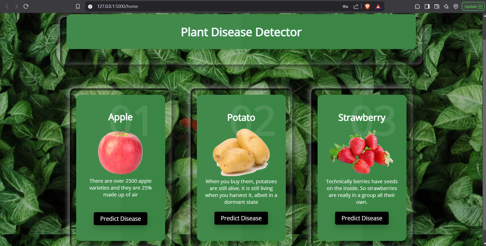
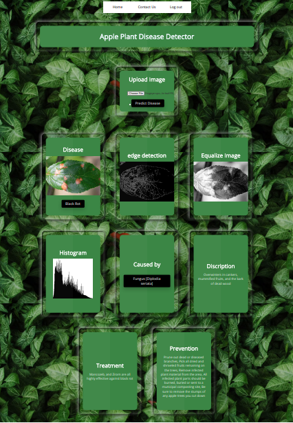

# 🌱 Plant-Disease-Detector

A web application that predicts plant diseases using machine learning models and image processing techniques.

## ✨ Features

- 🌾 Predict plant diseases for **Apple**, **Potato**, and **Strawberry** using pre-trained models.
- 🖼️ User-friendly web interface for uploading images and viewing predictions.
- ⚙️ Built with **Flask** for the backend and **HTML/CSS** for the frontend.
- 📂 Includes pre-trained models stored in the `Models` directory.

## 🚀 Getting Started

### 📋 Prerequisites

- 🐍 Python 3.6.2 or above
- Install the required dependencies:

```
pip install tensorflow==2.5.0 numpy pandas flask flask-cors pillow skimage opencv-python
```

### 📂 Project Structure

```
├── api.py                # Backend API for predictions
├── app.py                # Main application file
├── Models/               # Pre-trained models for predictions
├── src/                  # Source files for CSS, static files, and templates
├── images/               # Dataset images for testing
├── README.md             # Project documentation
├── requirements.txt      # Python dependencies
├── train_dataset.ipynb   # Notebook for training models
```

### ▶️ Running the Application

1. Start the backend API:
   ```
   python api.py
   ```

2. Start the web application:
   ```
   python app.py
   ```

3. Open the web application in your browser:
   ```
   http://127.0.0.1:5000/
   ```

4. Use the following credentials to log in:
   - **👤 Username**: `admin`
   - **🔑 Password**: `123456789`

### 🧪 Testing

If you don't have any images for testing, use the sample images provided in the `images/PlantVillage/data/` directory.

## 🧠 Models

The following pre-trained models are included in the `Models/` directory:
- 🍎 `Apple.h5`: Model for Apple disease prediction.
- 🥔 `Potato.h5`: Model for Potato disease prediction.
- 🍓 `Strawberry.h5`: Model for Strawberry disease prediction.

## 🖼️ Screenshots

### 🌟 Home Page


### 🌟 Prediction Page

